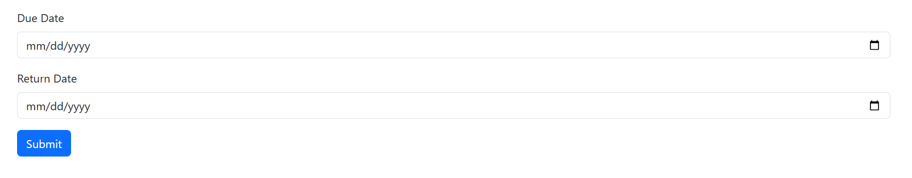

# Project Title
Library Book Checker

## Description
Compare 2 dates (the due date and return date), check if the book is overdue or not, and display how many days are left until the book is due/how many days the book is overdue.

## Requirements
- PHP installed (version 8)
- Local server (XAMPP, MAMP etc,)
- Web browser

## Installation
1. Clone or download the repository.
2. Place the project folder into your server’s web root (e.g., `htdocs/` for XAMPP).
3. Start the server.

## Repo
[EricaHsgen](https://github.com/EricaHsgen/LibraryBookChecker)

## Screenshot of homepage
